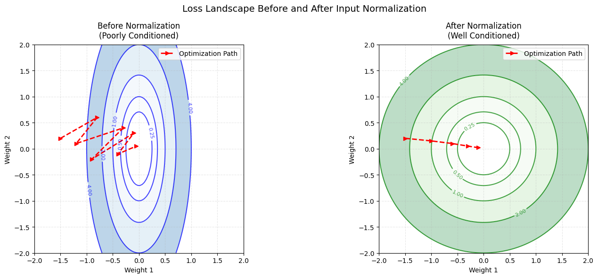

The issue Karpathy encounters in the third video is  **saturation in the tanh activation function**, which causes **vanishing gradients** in certain neurons.

---

### What’s Happening in Karpathy’s Code?

1. He initializes $W_2$ and $b_2$ with standard values.
2. After applying the **tanh activation**, a lot of neuron outputs become **-1 or 1**.
3. The derivative of **tanh** is:
   
   $\text{tanh}'(x) = 1 - \text{tanh}^2(x)$
4. 
   - When $x$ is large (positive or negative), **tanh saturates** (i.e., becomes close to -1 or 1).
   - In these regions, **the derivative approaches 0**, which **kills gradients** in backpropagation.
4. Since many neurons are stuck at -1 or 1, their gradients vanish, meaning those neurons **no longer learn**.

---

### What’s the Fix?  

To prevent saturation, he initializes the weights and biases with **very small values**. This ensures:
- The initial inputs to tanh are **closer to zero**, where the derivative of tanh is **large**.
- Gradients don’t vanish immediately.
- More neurons remain **active** and participate in learning.

This is a common trick when using **sigmoid or tanh activations**. However, in modern deep learning, we avoid this issue by using **ReLU activation** instead of tanh because:
- ReLU doesn’t saturate for positive values.
- It avoids vanishing gradients (except for dead ReLUs).

---

### Key Takeaways:
- **Karpathy’s issue was vanishing gradients due to tanh saturation**, not exploding gradients.
- **Neurons stuck at -1 or 1 have near-zero gradients**, stopping them from learning.
- **Initializing with small values** helps prevent immediate saturation.
- **ReLU is often preferred today** to avoid this problem altogether.


When Karpathy says the **"flat region of tanh"** or **"tail of tanh"**, he’s referring to the parts of the **tanh function** where the output is very close to -1 or 1, and the gradient (slope) is nearly zero.

---

### Understanding the **tanh** Function


The **tanh** function is defined as:

$$
\tanh(x) = \frac{e^x - e^{-x}}{e^x + e^{-x}}
$$

- It **squashes** input values into the range **(-1, 1)**.
- It is **S-shaped** (sigmoid-like) but centered at 0.

Now, let’s break down the terms **"flat region"** and **"tail"**.

---

### **1. Flat Region of tanh**
- The function **flattens out** when  $x$ is **very large or very small**.
- This happens because $\tanh(x)$ asymptotically approaches **1 for large $x$ and -1 for small $x$**.
- In these regions, the slope (gradient) is **close to zero**.

#### 🔥 **Why is this a problem?**
- During backpropagation, the weight updates depend on the **derivative** of tanh:
  
  $\tanh'(x) = 1 - \tanh^2(x)$
- If $x$ is **large or small**, then $\tanh(x) \approx 1$ or  -1 , and
  
  $\tanh'(x) \approx 0$

- Since the gradient is near **zero**, the neuron **stops learning** because backprop updates are **too small**.

---

### **2. Tail of tanh**
- The **"tail"** of the tanh function refers to its outer edges, where $x$ is very positive or very negative.
- These are the **regions where tanh saturates**, meaning:
  
  $\tanh(x) \approx 1 \quad \text{(for large \( x \))}, \quad \tanh(x) \approx -1 \quad \text{(for large negative \( x \))}$
  
- Again, in these regions, **gradients vanish**, stopping weight updates.

---

### **What Karpathy is Saying**
- When you initialize weights **too large**, many neuron activations end up in the **flat regions (tails)** of tanh.
- This **kills gradients**, making learning slow or stopping it entirely.
- His fix? **Initialize with smaller values** so activations stay in the **center of tanh**, where gradients are large.

---

### **Visualizing It**
Imagine the tanh curve:  
- The middle part (near $x = 0$) has a **steep slope** → Good for learning.  
- The tails (near $x \to \pm\infty$ are **flat** → Bad for learning.

This is why he tweaks the initialization to avoid the **flat/tail regions** and keep activations in the **steep region**.

---

### **Takeaway**
When Karpathy says **"flat region"** or **"tail"** of tanh, he means the parts where:
- The function has **low slope** (gradients close to zero).
- The network **stops learning** because backpropagation updates become tiny.
- The solution? **Smaller weight initialization** to keep activations in the center of tanh.


### Proper Weight Initialization Techniques 🚀  

Weight initialization is **critical** for stable and efficient training. A bad initialization can lead to **vanishing gradients**, **exploding gradients**, or slow convergence. Let's go through the best initialization strategies and when to use them.  

---

## **1. Xavier (Glorot) Initialization**  
📌 **Used for:** Sigmoid, Tanh, and shallow networks  
📌 **Goal:** Keep the variance of activations the same across layers.  

### **Formula**  
- **Uniform:**  
  
  $W \sim U\left(-\frac{\sqrt{6}}{\sqrt{\text{fan-in} + \text{fan-out}}}, \frac{\sqrt{6}}{\sqrt{\text{fan-in} + \text{fan-out}}}\right)$
- **Normal:**  
  
  $W \sim \mathcal{N}\left(0, \frac{1}{\text{fan-in} + \text{fan-out}}\right)$

📌 **When to use?**  
✅ Works well with **sigmoid and tanh** activations.  
✅ Keeps activation variance stable across layers.  

📌 **When NOT to use?**  
❌ Doesn't work well with **ReLU** (because ReLU has an asymmetric activation).  

---

## **2. He (Kaiming) Initialization**  
📌 **Used for:** ReLU, Leaky ReLU  
📌 **Goal:** Prevent vanishing/exploding gradients for ReLU-based networks.  

### **Formula**  
- **Uniform:**  
  
  $W \sim U\left(-\sqrt{\frac{6}{\text{fan-in}}}, \sqrt{\frac{6}{\text{fan-in}}}\right)$
  
- **Normal:**  
  
  $W \sim \mathcal{N}\left(0, \frac{2}{\text{fan-in}}\right)$
  

📌 **When to use?**  
✅ Best for **ReLU and Leaky ReLU** activations.  
✅ Helps avoid **dying ReLU** problem.  

📌 **When NOT to use?**  
❌ Not ideal for **sigmoid/tanh** (can still lead to saturation).  

---

## **3. Lecun Initialization**  
📌 **Used for:** Sigmoid, Tanh (mainly in shallow networks)  
📌 **Goal:** Helps control the variance of activations.  

### **Formula**  
- **Normal:**  
  
  $W \sim \mathcal{N}\left(0, \frac{1}{\text{fan-in}}\right)$


📌 **When to use?**  
✅ Works well with **sigmoid/tanh** in **shallow networks**.  
✅ Used in **LeNet** (old-school CNNs).  

📌 **When NOT to use?**  
❌ Not suited for **deep networks** (Xavier or He is better).  

---

## **4. Orthogonal Initialization**  
📌 **Used for:** RNNs, LSTMs, deep networks  
📌 **Goal:** Ensures weight matrices have unit norm, preventing gradient explosion or collapse.  

### **Steps:**  
1. Create a random weight matrix $W$  
2. Apply **QR decomposition** to make it orthogonal.  
3. Use the resulting **orthogonal matrix** as initialization.  

📌 **When to use?**  
✅ Works well in **deep networks & RNNs** to avoid instability.  

📌 **When NOT to use?**  
❌ Not useful for simple feedforward networks.  

---

## **5. Zero Initialization (⚠️ Never Use for Weights!)**  
📌 **Why?**  
- If all weights are initialized to **zero**, all neurons in a layer learn the **same thing** (symmetry problem).  
- This means the network won’t learn properly.  

✅ **Only biases can be initialized to zero** in some cases.  

---

## **6. Small Random Initialization**  
📌 **Used by Karpathy in his tiny MLP example**  
- If initial weights are **too large**, tanh/sigmoid saturates → **vanishing gradients**.  
- Using **very small random values** keeps activations in the **steep part of tanh/sigmoid**, so gradients are large.  

### **Formula**  

$W \sim \mathcal{N}(0, \epsilon)$
where $\epsilon$ is a **very small** number (e.g., 0.01).  

📌 **When to use?**  
✅ Small networks with **sigmoid/tanh** activations.  

📌 **When NOT to use?**  
❌ For ReLU networks, **He initialization** is better.  

---

## **Which One Should You Use?**
| Activation Function | Best Initialization |
|--------------------|--------------------|
| Sigmoid / Tanh | **Xavier (Glorot) / Lecun** |
| ReLU / Leaky ReLU | **He Initialization** |
| RNNs / LSTMs | **Orthogonal Initialization** |
| Small MLPs (Karpathy style) | **Small random values** |

---

## **Final Thoughts**
1. **Xavier** → Best for **sigmoid/tanh** networks.  
2. **He Initialization** → Best for **ReLU-based deep networks**.  
3. **Lecun** → Good for **shallow tanh/sigmoid networks**.  
4. **Orthogonal** → Best for **RNNs and very deep nets**.  
5. **Never initialize weights to zero** (except for biases).  

Proper initialization can **drastically** improve training stability and speed. 🚀  


---

# **Understanding Neural Network Initialization**

### **🔹 Why Does Initialization Matter?**

When training a deep neural network, we want to ensure:

1. **Activations don’t explode or vanish** as they pass through layers.
2. **Gradients don’t explode or vanish** during backpropagation.

If we randomly initialize weights without consideration, we might end up with:

- **Very large activations → exploding gradients → training becomes unstable.**
- **Very small activations → vanishing gradients → no learning happens.**

---

### **🔹 Starting With a Single Neuron**

A single neuron follows this computation:

$$
y = W \cdot x
$$

where:

- $x$ is the input.
- $W$ is the weight.
- $y$ is the output.

For a layer with multiple neurons:

$$
y_i = \sum_{j} W_{ij} x_j
$$

where each neuron **sums up** multiple weighted inputs. Now, let’s analyze **variance**.

---

### **🔹 Understanding Variance Propagation**

Assumptions:

- The input $x$ has mean **0** and variance **1** (a common case when inputs are normalized).
- The weight $W$ is sampled from a normal distribution $N(0, \sigma^2)$.

Since $y$ is a sum of multiple weighted inputs, we compute its variance:

$$
\text{Var}(y) = \sum_{j} \text{Var}(W_{ij} x_j)
$$

Since variance is **multiplicative** for independent variables:

$$
\text{Var}(y) = \sum_{j} \text{Var}(W) \cdot \text{Var}(x)
$$

$$
\text{Var}(y) = \sum_{j} \sigma^2 \cdot 1
$$

With **fan-in** input neurons:

$$
\text{Var}(y) = \text{fan-in} \times \sigma^2
$$

---

### **🔹 Why Normalize Variance to 1?**

To **keep activations stable**, we set:

$$
\text{Var}(y) \approx \text{Var}(x)
$$

Since $\text{Var}(x) = 1$, we enforce:

$$
\text{fan_in} \times \sigma^2 = 1
$$

Solving for $\sigma^2$:

$$
\sigma^2 = \frac{1}{\text{fan-in}}
$$

Taking the square root:

$$
\sigma = \frac{1}{\sqrt{\text{fan-in}}}
$$

This is **Xavier (Glorot) Initialization**, suitable for **tanh and sigmoid** activations.

---

### **🔹 Why Adjust for ReLU?**

For **ReLU**, half of the neurons become **zero** (since ReLU blocks negative values). This means the variance after ReLU is **halved**:

$$
\text{Var}(\text{ReLU}(y)) = \frac{1}{2} \text{Var}(y)
$$

To **compensate**, we multiply by 2:

$$
\sigma^2 = \frac{2}{\text{fan-in}}
$$

Taking the square root:

$$
\sigma = \sqrt{\frac{2}{\text{fan-in}}}
$$

This is **Kaiming (He) Initialization**, optimal for **ReLU-based networks**.

---

### **🔹 Summary of Initialization Methods**

| Activation            | Variance of Weights       | Standard Deviation               |
| --------------------- |---------------------------|----------------------------------|
| **Sigmoid / tanh**    | $\frac{1}{\text{fan-in}}$ | $\frac{1}{\sqrt{\text{fan-in}}}$ |
| **ReLU / Leaky ReLU** | $\frac{2}{\text{fan-in}}$ | $\sqrt{\frac{2}{\text{fan-in}}}$ |

---

### **🔹 PyTorch Implementation**

```python
import torch

# Xavier Initialization (for tanh, sigmoid)
torch.nn.init.xavier_normal_(w)

# Kaiming Initialization (for ReLU)
torch.nn.init.kaiming_normal_(w, mode='fan_in', nonlinearity='relu')
```

---

### **🔹 TL;DR**

- **Variance increases with depth**, so we must scale weights properly.
- **For tanh/sigmoid**, use $\frac{1}{\text{fan_in}}$.
- **For ReLU**, use $\frac{2}{\text{fan_in}}$ to compensate for inactive neurons.

---


The **main goal** of initialization is to ensure that activations and gradients remain well-scaled throughout the network. Here’s the breakdown:  

1. **Input Normalization**: We assume that our input $x$ is normalized (mean **0**, variance **1**).  
2. **Weight Initialization**: Since we can’t modify the input, we control the **distribution of weights** so that after the dot product, activations remain stable.  
3. **Avoiding Exploding/Vanishing Activations**: If weights are too large, activations explode → gradients explode. If weights are too small, activations shrink → gradients vanish.  
4. **Keeping Variance Stable**: We derived the required **variance** for weights so that after passing through multiple layers, the output remains well-scaled.  

So, the entire derivation ensures that:

$$
\text{Var}(y) \approx \text{Var}(x) = 1
$$

which prevents extreme values and helps avoid vanishing/exploding gradients.  

That’s why Xavier initialization is crucial for **sigmoid/tanh** and Kaiming is used for **ReLU** (which has a different behavior).  


Now lets answer how did we come up with idea that:

$$
\text{Var}(y) \approx \text{Var}(x)
$$

### **1️⃣ What Happens If $Var(y) > Var(x)$? (Exploding Activations)**
If the variance of $y$ **keeps increasing** at each layer, activations will grow larger and larger.  
- This leads to **large activations**, which cause activation functions (like tanh or sigmoid) to saturate.  
- In saturated regions, gradients are near **zero**, leading to **vanishing gradients** during backpropagation.  

### **2️⃣ What Happens If $Var(y) < Var(x)$? (Vanishing Activations)**
If the variance of $y$ **keeps decreasing**, activations shrink with each layer.  
- This results in **very small activations**, which means gradients will get **even smaller** during backpropagation.  
- Eventually, the network stops learning because gradients vanish entirely.  

### **3️⃣ Solution: Keep Variance Constant**
To avoid both of these problems, the best approach is to **maintain a stable variance** across layers. That means:  

$$
\text{Var}(y) \approx \text{Var}(x)
$$

This way:  
✅ No explosion of activations  
✅ No vanishing gradients  

By enforcing this condition, we **control the variance growth** across layers and ensure smooth gradient flow.  

### **So How Did We “Come Up” With This?**
We didn’t pull it out of thin air—it comes from empirical observations:  
- If variance grows too much → training is unstable.  
- If variance shrinks → gradients vanish.  
- Keeping variance stable leads to good learning.  

Mathematically, we **derive** the right weight variance $\sigma^2$ by forcing:  

$$
\text{Var}(y) = \text{Var}(x)
$$

which gives us the **Xavier/Glorot** and **Kaiming/He** initialization formulas.  

So, it's not an arbitrary We can’t set $Var(y) = Var(W)$ because we’re actually solving for Var(W). But we do have Var(x) (since we usually assume inputs are normalized), so we use that as our reference point.

Basically, we ask:

"What should the variance of W be so that, after the dot product, the variance of y stays the same as x?"


### Why Multiply by 2 for ReLU?

1️⃣ For activations like **tanh/sigmoid**, using **$1 / \sqrt{\text{fan_in}}$** works because their outputs are roughly balanced around zero and don’t drastically cut the variance.  

2️⃣ **ReLU, however, zeroes out negative values**, meaning half of the values are removed. Since the input $ y $ (before ReLU) was symmetric around zero, **ReLU keeps only the positive half**.  

3️⃣ Mathematically, this causes **$Var(ReLU(y)) = ½ Var(y)$** (variance gets halved).  

4️⃣ Normally, we ensure **$Var(y) = Var(x)$**, but since ReLU **cuts it in half**, we compensate by **doubling the variance of W**.  

5️⃣ Solving for **$Var(W)$**:  

   $$
   \frac{1}{2} \cdot \text{fan-in} \cdot \text{Var}(W) = 1
   $$

   $$
   \text{Var}(W) = \frac{2}{\text{fan-in}}
   $$

6️⃣ Taking the square root:  

   $$
   \sigma_W = \frac{\sqrt{2}}{\sqrt{\text{fan-in}}}
   $$


### **Why Do We Normalize Inputs?**
1️⃣ **Prevent One Feature from Dominating**  
   - Different input features may have vastly different scales (e.g., height in cm vs. weight in kg).  
   - If we don’t normalize, the feature with the larger magnitude will dominate the weight updates, making training inefficient.  

2️⃣ **Ensure a Well-Conditioned Loss Landscape**  
   - If inputs are not normalized, the **loss function** can have an **elliptical shape** instead of a nice round contour.  
   - This is because gradient descent moves more easily along dimensions where the loss changes **gradually** but struggles in directions where the loss changes **rapidly** (due to uneven feature scales).  

3️⃣ **Learning Rate Stability**  
   - In an elliptical loss function, the gradient descent updates become **skewed**, meaning one direction moves faster than another.  
   - If the learning rate is high, we might **overshoot** the minimum.  
   - To prevent instability, we’d have to use a **very small learning rate**, which **slows down training significantly**.  
   - By normalizing inputs, we make the loss contours more **circular**, allowing **faster and more stable convergence** with a reasonable learning rate.  




# Batch Normalization

### **Mathematical Formulation of Batch Normalization**  

For a given batch of inputs $ X $ with $ m$ samples and $ n $ features:  

$$
X = \begin{bmatrix} x_{1,1} & x_{1,2} & \dots & x_{1,n} \\ x_{2,1} & x_{2,2} & \dots & x_{2,n} \\ \vdots & \vdots & \ddots & \vdots \\ x_{m,1} & x_{m,2} & \dots & x_{m,n} \end{bmatrix}
$$

---

### **Step 1: Compute Mean**  
For each feature $ j $ (column-wise across the batch), we compute the mean:  

$$
\mu_j = \frac{1}{m} \sum_{i=1}^{m} x_{i,j}
$$

---

### **Step 2: Compute Variance**  
Variance for each feature $j$:  

$$
\sigma_j^2 = \frac{1}{m} \sum_{i=1}^{m} (x_{i,j} - \mu_j)^2
$$

To prevent division by zero, we use a small constant $\epsilon$.

---

### **Step 3: Normalize Each Input**  
Each input is then normalized using the computed mean and variance:  


$$
\hat{x}_{i,j} = \frac{x_{i,j} - \mu_j}{\sqrt{\sigma_j^2 + \epsilon}}
$$

This ensures that each feature has:  
- **Mean = 0**  
- **Variance = 1**  

---

### **Step 4: Scale and Shift (Learnable Parameters)**  
To allow the model to **learn an optimal distribution**, we introduce two learnable parameters:  
- $\gamma_j$  (scale)
- $\beta_j$  (shift) 

Final transformation:  

$$
y_{i,j} = \gamma_j \hat{x}_{i,j} + \beta_j
$$

This step **reintroduces flexibility** so that normalization does not overly constrain the network.

---

### **Summary of Batch Normalization Formula**
$$
y_{i,j} = \gamma_j \frac{x_{i,j} - \mu_j}{\sqrt{\sigma_j^2 + \epsilon}} + \beta_j
$$

---

### **Why Does This Work?**
1. **Stabilizes training** by reducing internal covariate shift.  
2. **Allows higher learning rates**, making training faster.  
3. **Reduces dependence on weight initialization**.  
4. **Improves generalization** by acting as a form of regularization.  

### **Intuition Behind Shift and Scale in Batch Normalization (γ and β)**
Batch Normalization (BatchNorm) doesn’t just normalize activations—it **also learns how much to scale and shift them** using two trainable parameters:  
- **γ (scale)** → Controls how "spread out" the activations should be.  
- **β (shift)** → Adjusts the center (mean) of the activations.  

---

### **1️⃣ Why Do We Need Shift $β$ and Scale $γ$?**  
Once we normalize activations to **zero mean and unit variance**, they become **standardized**. However, some activation functions (like ReLU) **might not work optimally** if they always receive normalized inputs.  

Example:  
- **ReLU (max(0, x))** is heavily affected if too many inputs are negative (causing dead neurons).  
- Without **$γ$** and **$β$**, the model loses flexibility in learning useful feature distributions.  
- **BatchNorm fixes this by allowing the network to learn the best scale $γ$ and shift $β$ dynamically!**  

---

### **2️⃣ What Do γ and β Do?**  
Once the activations are normalized as:  

$$
\hat{x} = \frac{x - \mu}{\sigma}
$$

We apply a **learnable transformation**:

$$
y = \gamma \hat{x} + \beta
$$

- **$γ$ > 1** → Expands the activations (increases variance).  
- **0 < $γ$ < 1** → Compresses the activations (reduces variance).  
- **$β$ shifts** the activations left or right, changing the mean.  

**Key Benefit:**  
- Instead of forcing activations to always have mean 0 and variance 1, BatchNorm **allows the network to choose the best scale and shift for each layer**! 🚀  

---

### **3️⃣ Intuition With Real-Life Example**
Think of **$γ$** and **$β$** like adjusting the brightness and contrast on an image:  
- **γ (scale)** is like adjusting the contrast. Higher γ makes features more distinct, while lower γ makes them more uniform.  
- **β (shift)** is like adjusting the brightness. It shifts the entire distribution up or down.  

This makes sure the network can still express powerful transformations while keeping training stable.  

---

### **4️⃣ TL;DR - Why Shift and Scale?**
✅ Normalization stabilizes training but can remove useful distribution shifts.  
✅ **$γ$ (scale) and $β$ (shift)** let the model **learn** the optimal activation distribution.  
✅ Prevents restricting the model to a fixed zero-mean, unit-variance space.  
✅ Helps non-linear activations like ReLU work better by shifting distributions away from dead zones.  

BatchNorm isn’t just normalization—it’s an **adaptive transformation** that improves model expressiveness! 🚀


### **How Are Mean and Variance Calculated During Testing?**  
During **testing (inference)**, BatchNorm **does not** compute the mean and variance from the current batch like it does during training. Instead, it uses **running estimates** of mean and variance that were computed during training.  

During **training**, BatchNorm maintains **running statistics**: 

$$
\mu_{\text{running}} = (1 - \alpha) \cdot \mu_{\text{running}} + \alpha \cdot \mu_{\text{batch}}
$$

$$
\sigma^2_{\text{running}} = (1 - \alpha) \cdot \sigma^2_{\text{running}} + \alpha \cdot \sigma^2_{\text{batch}}
$$

where:  
- $\alpha$ (momentum, typically ~0.9) controls how much we update the running averages.  
- $\mu_{\text{batch}}$ and $\sigma^2_{\text{batch}}$ are the mean and variance of the **current batch** during training.  

During **testing**, instead of using batch statistics, we use these **precomputed running mean and variance**:  

$$
\hat{x} = \frac{x - \mu_{\text{running}}}{\sqrt{\sigma^2_{\text{running}} + \epsilon}}
$$

where $\epsilon$ is a small constant to prevent division by zero.

### **Why Do We Do This?**  
- Inference might have **only one sample or a different batch size**, so computing statistics per batch isn’t stable.  
- Using **running statistics ensures consistent normalization** across different batch sizes.  

So, **training uses batch-wise stats**, but **testing uses the accumulated running estimates** for stability.

#### Batch Normalization (BN) **acts like a form of data augmentation**, but at the activation level instead of the input level.  

To break it down:  

1. **Without BN**  
   - Each activation is **only** a function of the input and the learned weights.  
   - If an input appears multiple times, the model might **memorize its exact activation**, leading to overfitting.  

2. **With BN**  
   - The activation isn’t just a function of the input; it also depends on **the batch’s mean and variance**.  
   - Since every mini-batch is **randomly sampled**, the mean and variance change slightly every time.  
   - This means the **same input can have different activations** across training iterations.  

### **Why Is This Like Augmentation?**
- Normal data augmentation (cropping, rotation, noise) **modifies the input** to make it look different.  
- BN **modifies activations** dynamically by shifting and scaling them based on batch statistics.  
- This prevents the model from **latching onto fixed activation patterns** and forces it to **learn more generalizable features**.  

### **Final Takeaway**
BN **randomly perturbs activations**, making the model see the same input differently across batches. This acts as **implicit regularization**, reducing overfitting and improving generalization.

### Why Is BN Considered Regularization?
- It prevents the network from relying too much on specific activations.
- It introduces randomness (noise) in activations, similar to dropout.
- It makes training more stable, allowing larger learning rates, which indirectly prevents overfitting.

### **Why Does Penalizing Large Weights Help Generalization?**  

Regularization (like L2) **prevents overfitting** by controlling how much the model depends on any single feature. Let’s break it down step by step.  

---

### **1. L2 Regularization (Ridge Regression)**
L2 regularization **adds the squared sum of weights** to the loss function:

$$
\mathcal{L} = \text{Loss}(\hat{y}, y) + \lambda \sum w^2
$$

where:
- $\mathcal{L}$ = total loss (original loss + penalty)
- $\lambda$ = regularization strength (higher = more penalty)
- $w^2$ = sum of squared weights  

---

### **2. Why Does This Penalize Large Weights?**
- The squared term **grows rapidly** for larger weights (e.g., \( 10^2 = 100 \) vs. \( 2^2 = 4 \)).  
- The optimizer now has to **balance reducing the training loss vs. keeping weights small**.  
- So, it **pushes the model to use smaller, more "conservative" weights** instead of extreme values.  

---

### **3. How Does This Improve Generalization?**
- **Without Regularization:** The model might rely too much on certain features by assigning them **very large weights**. This makes it highly sensitive to small changes in the input, leading to **overfitting**.  
- **With L2 Regularization:** The model is forced to distribute importance **more evenly across all features** rather than depending on just a few dominant ones.  
- This makes the model **more stable to unseen data** (i.e., it generalizes better).  

---

### **4. Intuition With an Example**
Imagine we’re predicting house prices based on:
1. **Number of bedrooms**
2. **Square footage**
3. **Neighborhood quality**  

Without regularization:
- The model might **assign an extremely high weight** to "Neighborhood quality" because it correlates well with price in the training data.
- If a new unseen house comes from a slightly different neighborhood, the model might make **a huge incorrect prediction** because it’s over-relying on that one feature.

With L2 regularization:
- The model is **forced to give more balanced weights** across all three features.
- Now, if a new house is in a different neighborhood, the model still considers other features like **square footage and bedrooms**, reducing the error.

---

### **5. Another View: Smoother Decision Boundaries**
- Models with large weights tend to have **very sharp and complex decision boundaries**, which work great on training data but fail on test data.  
- Regularization **smooths** the decision boundary, making it **simpler and more robust**.  

---

### **Final Takeaway**
L2 regularization works by **penalizing extreme weights**, encouraging the model to distribute importance more evenly. This prevents overfitting by reducing sensitivity to noise in the training data, making the model **more stable and better at handling new data**.
